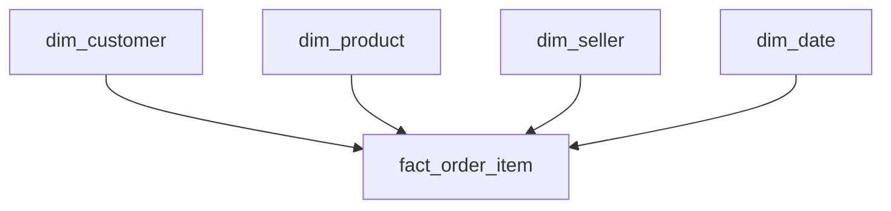
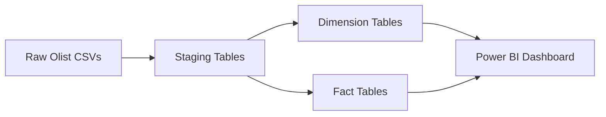

```mermaid
flowchart TB

    CUSTOMER[dim_customer]
    PRODUCT[dim_product]
    SELLER[dim_seller]
    DATE[dim_date]

    FACT[fact_order_item]

    CUSTOMER --> FACT
    PRODUCT --> FACT
    SELLER --> FACT
    DATE --> FACT
```

```mermaid
flowchart LR

    RAW[Raw Olist CSVs]
    STAGING[Staging Tables]
    DIMS[Dimension Tables]
    FACT[Fact Tables]
    PBI[Power BI Dashboard]

    RAW --> STAGING
    STAGING --> DIMS
    STAGING --> FACT
    DIMS --> PBI
    FACT --> PBI
    
```