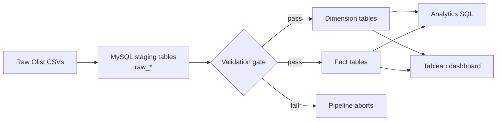
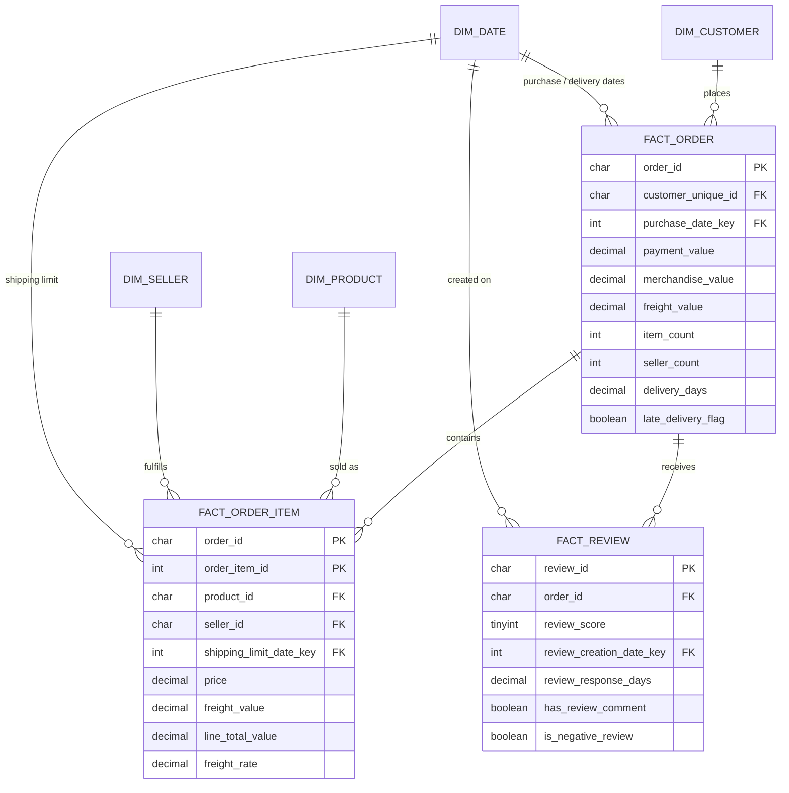

# Sales Intelligence Platform — Olist E-Commerce

An end-to-end analytics project built on the [Olist Brazilian E-Commerce Public Dataset](https://www.kaggle.com/datasets/olistbr/brazilian-ecommerce). Raw CSV exports are loaded into MySQL, validated, and transformed into a star schema that powers SQL analysis and a BI dashboard covering revenue, customers, delivery operations, and customer satisfaction.

**Stack:** Python · MySQL 8 · SQL · pandas · Jupyter · Tableau (previously Power BI / DAX)

---

## Table of Contents

- [Business Questions](#business-questions)
- [Architecture](#architecture)
- [Data Model](#data-model)
- [Key Findings](#key-findings)
- [Repository Structure](#repository-structure)
- [Getting Started](#getting-started)
- [Data Quality](#data-quality)
- [Analytics Queries](#analytics-queries)
- [Dashboard](#dashboard)
- [Documentation](#documentation)

---

## Business Questions

The platform is designed for sales, operations, and customer experience teams, and answers four groups of questions (full definitions in [`docs/business_requirements.md`](docs/business_requirements.md)):

| Area | Core metrics |
| --- | --- |
| Financial | Total revenue, revenue growth %, orders, average order value |
| Customer | Total customers, repeat purchase rate |
| Operations | Average delivery time, late delivery rate |
| Experience | Average review score |

---

## Architecture



The pipeline (`code/pipeline/run_pipeline.py`) runs four SQL steps in order:

1. **`schema.sql`** — creates the `sales_intelligence` database, raw staging tables, and the star schema.
2. **`load_raw_data.sql`** — clears the staging tables, then bulk-loads the nine CSVs with `LOAD DATA LOCAL INFILE`, converting blank timestamps to `NULL`.
3. **`validate_raw_data.sql`** — row counts plus null-key, duplicate-grain, referential-integrity, and business-rule checks. Any failed check stops the pipeline.
4. **`transform_data.sql`** — rebuilds the dimensions and facts and prints post-transform row counts.

Every step is rerunnable, so the full pipeline can be run repeatedly without duplicating data.

---

## Data Model

A star schema with three fact tables at different grains, sharing conformed dimensions. `dim_date` is a role-playing dimension: `fact_order` references it for purchase, approval, carrier handoff, delivery, and estimated delivery dates.



| Table | Grain | Notes |
| --- | --- | --- |
| `dim_customer` | One row per `customer_unique_id` | Olist issues a new `customer_id` per order, so repeat-customer analysis must use `customer_unique_id`. Location reflects the most recent order. |
| `dim_product` | One row per `product_id` | English category names via the translation table; missing categories kept as `unknown`. Derived `product_volume_cm3`. |
| `dim_seller` | One row per `seller_id` | Seller city, state, zip prefix. |
| `dim_date` | One row per calendar date in the source data | Year, quarter, month, ISO week, weekday, weekend flag. |
| `fact_order` | One row per order | Payments and items are pre-aggregated before joining to preserve grain. Includes approval, handling, and delivery durations plus a late-delivery flag. |
| `fact_order_item` | One row per order line | Price, freight, line total, freight rate. |
| `fact_review` | One row per review | Score, response time, comment and sentiment flags. |

---

## Key Findings

From [`data_exploration.ipynb`](data_exploration.ipynb) and the analytics queries.

**Headline numbers (Sep 2016 – Oct 2018)**

| Metric | Value |
| --- | --- |
| Orders | 99,441 |
| Unique customers | 96,096 |
| Sellers / products | 3,095 / 32,951 |
| Total payment value | R$ 16.01M |
| Merchandise / freight | R$ 13.59M / R$ 2.25M |
| Average order value | R$ 160.99 |
| Median delivery time | 10 days |
| Late delivery rate | 8.1% |
| Average review score | 4.09 / 5 |

**Insights**

1. **Late deliveries drive bad reviews.** The relationship is monotonic: 31% of 1-star orders arrived late versus 3% of 5-star orders, and average delivery time falls from 20.8 days (1-star) to 10.2 days (5-star).
2. **Demand is concentrated in São Paulo.** SP accounts for 41,746 orders (~42%), while most northeastern states see 15–24% late delivery rates and longer delivery times, pointing to inter-state logistics costs.
3. **Repeat purchasing is rare.** Only about 3% of customers place more than one order, visible only when counting by `customer_unique_id`.
4. **Sep–Oct 2018 is a truncation artifact.** Those months contain 16 and 4 orders respectively and should be excluded from trend and growth calculations.
5. **Freight economics vary by category.** Freight is ~17% of merchandise value overall but much higher for bulky, low-price categories. `health_beauty` leads revenue (R$ 1.26M); `watches_gifts` earns similar revenue with far fewer sellers.

**Domain caveat:** Olist sends the review survey at delivery or at the estimated delivery date, whichever comes first. Late orders can therefore show a *negative* days-to-review value — this is a real signal, not a data error.

---

## Repository Structure

```
sales-intelligence-platform/
├── code/
│   ├── pipeline/
│   │   └── run_pipeline.py          # Orchestrates the SQL steps with a validation gate
│   ├── sql/
│   │   ├── ddl/schema.sql           # Staging tables + star schema
│   │   ├── dml/
│   │   │   ├── load_raw_data.sql    # LOAD DATA LOCAL INFILE for all CSVs
│   │   │   ├── validate_raw_data.sql
│   │   │   └── transform_data.sql   # Builds dimensions and facts
│   │   └── analytics/
│   │       ├── revenue_analysis.sql
│   │       ├── customer_analysis.sql
│   │       ├── product_analysis.sql
│   │       └── regional_analysis.sql
│   └── utils/
│       ├── helpers.py               # MySqlManager: connection retries, SQL file execution
│       └── loggerexc.py             # Logger + base exception
├── configs/config.yaml
├── logs/                            # Pipeline logs (git-ignored)
├── data/raw/                        # Olist CSVs (git-ignored)
├── docs/
│   ├── business_requirements.md
│   ├── data_dictionary.md
│   ├── dbschema.md
│   └── architecture.md
├── data_exploration.ipynb           # EDA
├── .env.example                     # Connection settings template
├── requirements.txt
└── README.md
```

---

## Getting Started

### Prerequisites

- Python 3.10+
- MySQL 8.0+ with `local_infile` enabled on the server:
  ```sql
  SET GLOBAL local_infile = 1;
  ```

### 1. Clone and install

```bash
git clone <your-repo-url>
cd sales-intelligence-platform
python -m venv .venv
source .venv/bin/activate        # Windows: .venv\Scripts\activate
pip install -r requirements.txt
```

### 2. Get the data

Download the dataset from [Kaggle](https://www.kaggle.com/datasets/olistbr/brazilian-ecommerce) and place the nine CSV files in `data/raw/`:

```
olist_customers_dataset.csv          olist_order_reviews_dataset.csv
olist_geolocation_dataset.csv        olist_orders_dataset.csv
olist_order_items_dataset.csv        olist_products_dataset.csv
olist_order_payments_dataset.csv     olist_sellers_dataset.csv
product_category_name_translation.csv
```

To keep the CSVs somewhere else, set `RAW_DATA_DIR` in `.env` (absolute, or relative to the project root).

### 3. Configure the database connection

```bash
cp .env.example .env
```

Then fill in your credentials:

```env
DB_HOST=127.0.0.1
DB_PORT=3306
DB_USER=your_user
DB_PASSWORD=your_password
```

The pipeline creates the `sales_intelligence` database itself, so no manual setup is needed.

### 4. Run the pipeline

From the project root:

```bash
python code/pipeline/run_pipeline.py
```

The runner checks that all nine CSVs exist before connecting. Logs go to the console and to `logs/app.log`. A successful run ends with the star-schema row counts and `Pipeline completed successfully.`

---

## Data Quality

Checks enforced by `validate_raw_data.sql`:

| Check type | Examples |
| --- | --- |
| Required keys | No null or empty IDs in any table |
| Grain | No duplicate `order_id`, `(order_id, order_item_id)`, `review_id`, etc. |
| Referential integrity | Every order has a customer; every item has an order, product, and seller |
| Business rules | No negative prices, freight, or payments; review scores between 1 and 5; delivery and approval not before purchase |
| Datetime hygiene | Zero-dates in review timestamps are detected and nulled |

Known characteristics of the source data, handled during transformation:

- **Geolocation** has 261,831 duplicate rows and multiple coordinates per zip prefix — aggregate before joining.
- **Review text** is sparse (88% missing titles, 59% missing messages); this is expected and not treated as an error.
- **610 products** have no category; they are kept as `unknown` instead of dropped.
- **Undelivered orders** (~3%) have null delivery dates and are excluded from delivery metrics.

---

## Analytics Queries

| File | Covers |
| --- | --- |
| `revenue_analysis.sql` | Monthly revenue and AOV, MoM growth, revenue by order status, clean revenue excluding canceled/unavailable orders, merchandise vs. freight split, payment type mix |
| `customer_analysis.sql` | Repeat purchase rate, new and cumulative customers by month, revenue by state and city, order-frequency distribution, customer lifetime value |
| `product_analysis.sql` | Top categories and sellers, category freight rate, seller revenue concentration, review score by category, items per order, category trends |
| `regional_analysis.sql` | Late delivery rate and delivery time by state, seller-state revenue, same-state vs. cross-state delivery performance, review score by state |

Business rules applied consistently across queries:

- Revenue = `SUM(payment_value)`; canceled and unavailable orders are excluded from headline figures.
- Delivery metrics use only orders with a delivered customer date.
- Repeat purchase rate uses `customer_unique_id`, never `customer_id`.

---

## Dashboard

The dashboard was first built in Power BI and is being rebuilt in Tableau on top of the star schema. It covers headline KPIs, revenue and order trends, delivery performance by state, and customer satisfaction.

---

## Documentation

- [`docs/business_requirements.md`](docs/business_requirements.md) — users, metrics, formulas, business rules
- [`docs/data_dictionary.md`](docs/data_dictionary.md) — every raw column, derived field, and analytical table
- [`docs/dbschema.md`](docs/dbschema.md) — full entity-relationship diagram

---

## Acknowledgements

Data: [Olist Brazilian E-Commerce Public Dataset](https://www.kaggle.com/datasets/olistbr/brazilian-ecommerce), released under CC BY-NC-SA 4.0.
