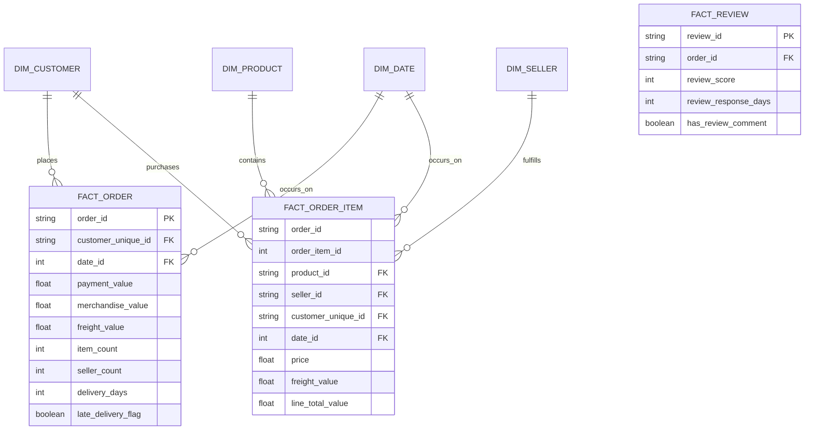

```mermaid
erDiagram
    DIM_CUSTOMER ||--o{ FACT_ORDER : places
    DIM_CUSTOMER ||--o{ FACT_ORDER_ITEM : purchases

    DIM_PRODUCT ||--o{ FACT_ORDER_ITEM : contains

    DIM_SELLER ||--o{ FACT_ORDER_ITEM : fulfills

    DIM_DATE ||--o{ FACT_ORDER : occurs_on
    DIM_DATE ||--o{ FACT_ORDER_ITEM : occurs_on

    FACT_ORDER {
        string order_id PK
        string customer_unique_id FK
        int date_id FK

        float payment_value
        float merchandise_value
        float freight_value

        int item_count
        int seller_count

        int delivery_days
        boolean late_delivery_flag
    }

    FACT_ORDER_ITEM {
        string order_id
        int order_item_id

        string product_id FK
        string seller_id FK
        string customer_unique_id FK

        int date_id FK

        float price
        float freight_value
        float line_total_value
    }

    FACT_REVIEW {
        string review_id PK
        string order_id FK

        int review_score
        int review_response_days
        boolean has_review_comment
    }
```