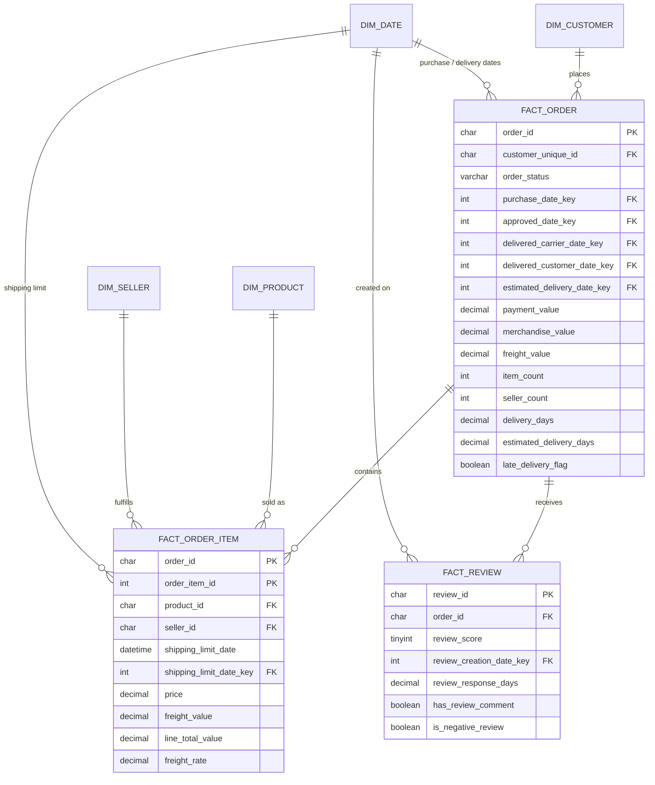

# Database Schema

Star schema in the `sales_intelligence` database, built by `code/sql/ddl/schema.sql` and populated by `code/sql/dml/transform_data.sql`.

`dim_date` is a role-playing dimension: `fact_order` joins to it five times (purchase, approval, carrier handoff, customer delivery, estimated delivery). Customer attributes reach item-level analysis through `fact_order`, not directly.

